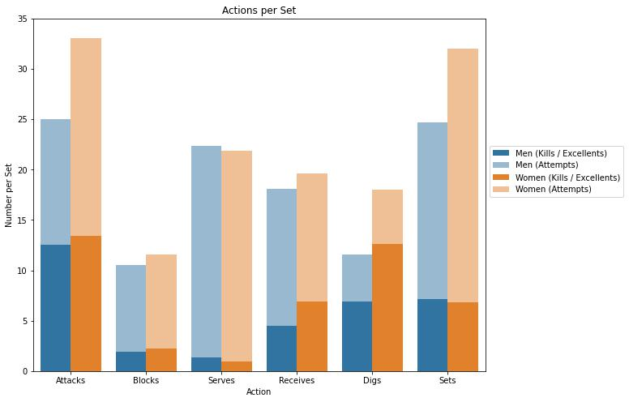
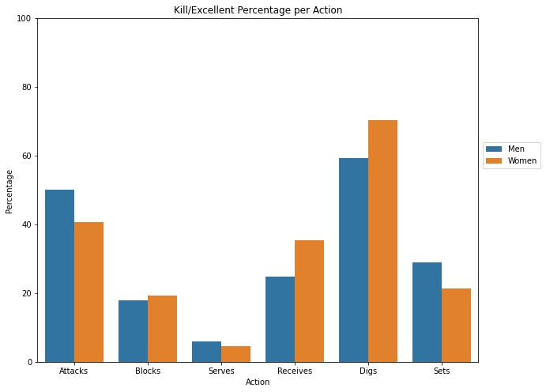
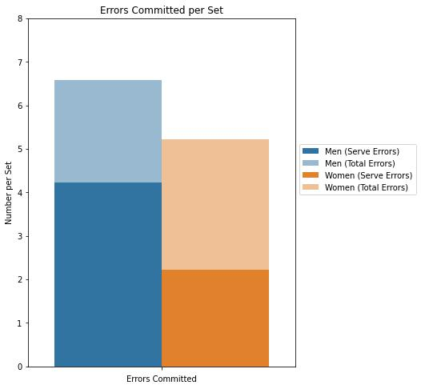
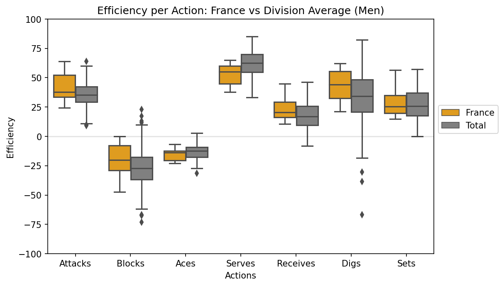
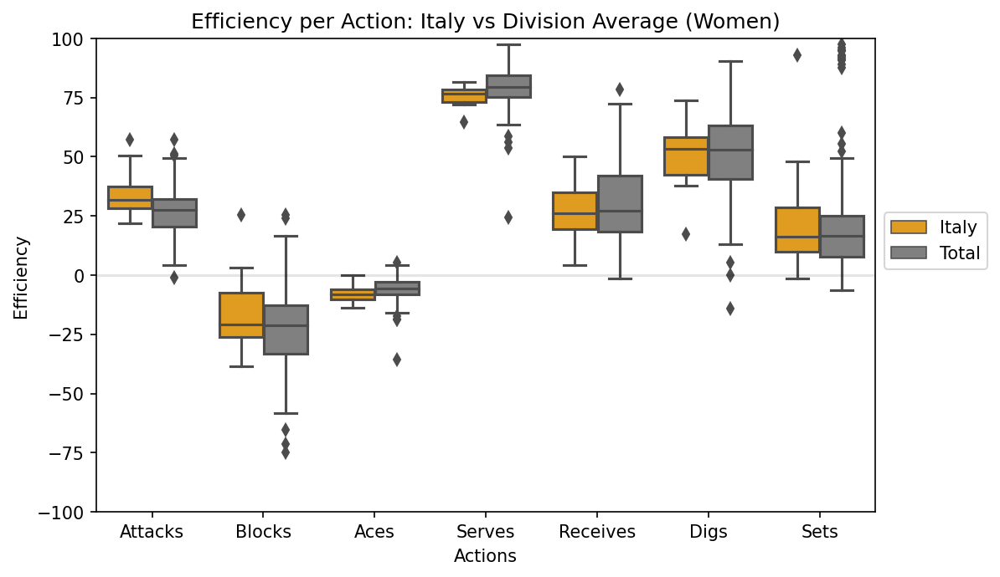

# VNL 2022 Statistics Exploration

<!-- Add intro for VNL
-->

## Volleyball Basics

<!--
6 players, 3 contacts to send the ball to the opponent's side of the court.

LOOK FOR VIDEO EXPLAINING THE BASICS 
-->

## Data Collection

Data was scraped from the [VNL 2022 website](https://en.volleyballworld.com/volleyball/competitions/vnl-2022/). BeautifulSoup and Requests-HTML libraries were used for the web scrappers. The code can be found on the scripts folder of the project.

## Data Preparation

Notebook: [01-preprocessing.ipynb](./notebooks/01-preprocessing.ipynb)

The data collected was processed using Pandas. Data was condensed into two separate csv files: one for individual statistics ([player_stats.csv](./data/player_stats.csv)) and the other for team statistics ([team_stats.csv](./data/team_stats.csv)).

<!--
Should I explain the processing?
How to tag a notebook
-->

## Data Exploration 01: Comparison of Men's vs Women's Matches

Notebook: [02-mens-vs-womens-comparison.ipynb](./notebooks/02-men-vs-women-comparision.ipynb)

Data was analyzed to look into the differences between the men's and women's matches with a focus on (1) the amount of actions (attacks, blocks, serves, etc.) done per set, (2) the execution of each action and (3) the errors committed.

The following are the resulting graphs from the analysis:

## Data Exploration 02: Team Stat Analysis

Notebook: [03-team-stat-analysis.ipynb](./notebooks/03-team-stat-analysis.ipynb)

Comparison was made between each team's efficiency rate per action versus their division average. Output were the following graphs for each team:

Graphs:

